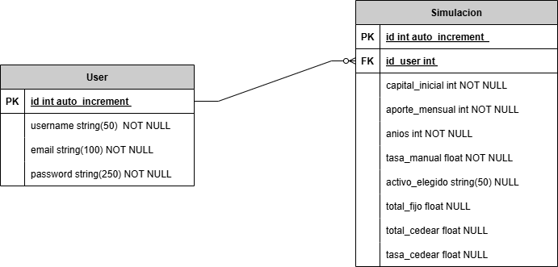

# FIC CedearPy 📈 - Simulador de Interés Compuesto y CEDEARs

Una aplicación web Full-Stack diseñada para proyectar el crecimiento del capital mediante el interés compuesto. Permite a los usuarios comparar estrategias de ahorro tradicionales (tasas fijas) contra el rendimiento histórico real de los principales CEDEARs del mercado financiero.

## 🚀 Características Principales

- **Simulador Interactivo:** Cálculo de interés compuesto con capital inicial, aportes mensuales y plazos personalizables.
- **Conexión al Mercado Real:** Integración con la API de Yahoo Finance (`yfinance`) para obtener el rendimiento histórico de empresas como Apple, Microsoft, S&P 500, entre otras.
- **Gráficos Dinámicos:** Visualización del crecimiento proyectado mes a mes utilizando `Chart.js`.
- **Generación de Reportes:** Exportación del historial de simulaciones a documentos PDF con formato profesional usando `jsPDF`.
- **Sistema de Usuarios Seguro:** Registro, inicio de sesión y recuperación de contraseñas mediante tokens seguros enviados por correo electrónico (`Flask-Mail` / `smtplib`).
- **Diseño Responsive:** Interfaz moderna (Glassmorphism) totalmente adaptable a dispositivos móviles (Mobile First).

## 🛠️ Tecnologías Utilizadas

- **Backend:** Python, Flask, Flask-SQLAlchemy.
- **Frontend:** HTML5, CSS3, JavaScript (Vanilla), Chart.js.
- **Base de Datos:** SQLite.
- **Librerías Extra:** `yfinance` (Datos de mercado), `python-dotenv` (Variables de entorno), `itsdangerous` (Tokens de seguridad).

## 🗄️ Arquitectura de la Base de Datos

El sistema utiliza una base de datos relacional con dos tablas principales (`User` y `Simulacion`) vinculadas mediante una clave foránea (One-to-Many).



## ⚙️ Instalación y Ejecución Local

Sigue estos pasos para correr el proyecto en tu entorno local:

1. **Clonar el repositorio:**
   ```bash
   git clone [https://github.com/marianoborgini1/compound_interest_cedearpy.git](https://github.com/marianoborgini1/compound_interest_cedearpy.git)
   cd compound_interest_cedearpy
   ```

2. **Crear y activar un entorno virtual:**
   ```bash
   python -m venv env
   # En Windows:
   env\Scripts\activate
   # En Mac/Linux:
   source env/bin/activate
   ```

3. **Instalar las dependencias:**
   ```bash
   pip install -r requirements.txt
   ```

4. **Configurar las variables de entorno:**
   Crea un archivo llamado `.env` en el directorio raíz del proyecto y agrega tus claves:
   ```text
   FLASK_SECRET_KEY=tu_clave_secreta_aqui
   TOKEN_SECRET_KEY=tu_clave_para_tokens_aqui
   MAIL_USER=tu_correo@gmail.com
   MAIL_PASS=tu_contraseña_de_aplicacion_aqui
   ```

5. **Ejecutar la aplicación:**
   ```bash
   python app.py
   ```
   *La aplicación estará disponible en `http://127.0.0.1:5000`*

## 👨‍💻 Autor

Desarrollado por **Mariano Borgini** - Software Developer.
- [LinkedIn](https://www.linkedin.com/in/mariano-borgini-dev)
- [GitHub](https://github.com/marianoborgini1)
